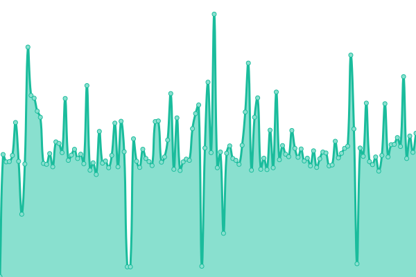
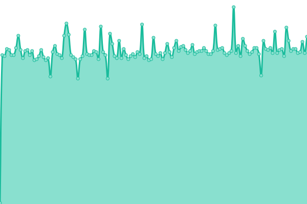
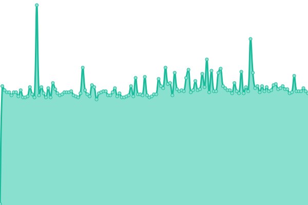

# [📈 Live Status](https://plantnet.github.io/status): <!--live status--> **🟩 All systems operational**

This repository contains the open-source uptime monitor and status page for [Pl@ntNet](https://plantnet.org), powered by [Upptime](https://github.com/upptime/upptime).

With [Upptime](https://upptime.js.org), you can get your own unlimited and free uptime monitor and status page, powered entirely by a GitHub repository. We use [Issues](https://github.com/plantnet/status/issues) as incident reports, [Actions](https://github.com/plantnet/status/actions) as uptime monitors, and [Pages](https://plantnet.github.io/status) for the status page.

<!--start: status pages-->
<!-- This summary is generated by Upptime (https://github.com/upptime/upptime) -->
<!-- Do not edit this manually, your changes will be overwritten -->
<!-- prettier-ignore -->
| URL | Status | History | Response Time | Uptime |
| --- | ------ | ------- | ------------- | ------ |
|  API (my.plantnet.org) | 🟩 Up | [api-my-plantnet-org.yml](https://github.com/plantnet/status/commits/HEAD/history/api-my-plantnet-org.yml) | 

 110ms
     
 | 

<a href="https://plantnet.github.io/status/history/api-my-plantnet-org">100.00%</a>
    

|  API (my.plantnet.org) identification | 🟩 Up | [api-my-plantnet-org-identification.yml](https://github.com/plantnet/status/commits/HEAD/history/api-my-plantnet-org-identification.yml) | 

 589ms
     
 | 

<a href="https://plantnet.github.io/status/history/api-my-plantnet-org-identification">100.00%</a>
    

|  [Pl@ntNet Apps (include database)](https://api.plantnet.org/v1/projects/weurope/observations) | 🟩 Up | [pl-nt-net-apps-include-database.yml](https://github.com/plantnet/status/commits/HEAD/history/pl-nt-net-apps-include-database.yml) | 

 341ms
     
 | 

<a href="https://plantnet.github.io/status/history/pl-nt-net-apps-include-database">100.00%</a>
    

|  [Image server](https://bs.plantnet.org/image/o/e776015a3c885cd7ede6ee713115acb9665c37c5) | 🟩 Up | [image-server.yml](https://github.com/plantnet/status/commits/HEAD/history/image-server.yml) | 

 176ms
     
 | 

<a href="https://plantnet.github.io/status/history/image-server">100.00%</a>
    

|  [Identification engine](https://api-test.plantnet.org/status/identification) | 🟩 Up | [identification-engine.yml](https://github.com/plantnet/status/commits/HEAD/history/identification-engine.yml) | 

 409ms
     
 | 

<a href="https://plantnet.github.io/status/history/identification-engine">100.00%</a>
    

|  Upptime status checks | 🟩 Up | [upptime-status-checks.yml](https://github.com/plantnet/status/commits/HEAD/history/upptime-status-checks.yml) | 

 120ms
     
 | 

<a href="https://plantnet.github.io/status/history/upptime-status-checks">100.00%</a>
    

<!--end: status pages-->

[**Visit our status website →**](https://plantnet.github.io/status)

## 📄 License

- Powered by: [Upptime](https://github.com/upptime/upptime)
- Code: [MIT](./LICENSE) © [Pl@ntNet](https://plantnet.org)
- Data in the `./history` directory: [Open Database License](https://opendatacommons.org/licenses/odbl/1-0/)
